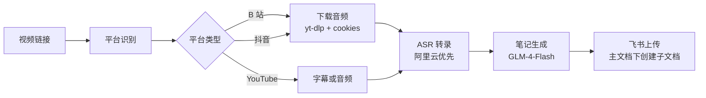

# 🎬 视频学习助手 - Skill 文档

> **最后更新**: 2026 年 3 月 15 日  
> **作者**: 谭明 (Boss)  
> **版本**: v2.1  
> **飞书主文档**: https://vicyrpffceo.feishu.cn/docx/LrTAdVQEnoKG1nxxKO5c5JjCn6p

---

## 📋 概述

**核心功能**: 下载视频 → 语音转录 → 智能笔记 → 飞书上传

**工作流程**:
```
视频链接 → 平台识别 → 音频/字幕获取 → ASR 转录 → 笔记生成 → 飞书上传
                                              ↓
                                         主文档下创建子文档
```

**性能指标**:
- ASR 转录：9-15 秒 (阿里云) vs 30-40 秒 (Whisper)
- 完整流程：~25 秒
- 笔记质量：⭐⭐⭐⭐⭐ (GLM-4-Flash 结构化笔记)

---

## 🚀 核心功能

### 1. 视频处理流程



### 2. 平台支持

| 平台 | 下载方式 | ASR 引擎 |
|------|---------|---------|
| **B 站** | yt-dlp + cookies | 阿里云 qwen3-asr-flash (默认) |
| **YouTube** | 官方字幕 > 音频 | 阿里云 qwen3-asr-flash (默认) |
| **抖音** | yt-dlp + audio | 阿里云 qwen3-asr-flash (默认) |

### 3. ASR 转录引擎（智能路由）

| 引擎 | 速度 | 准确率 | 成本 | 用途 |
|------|------|--------|------|------|
| **阿里云 qwen3-asr-flash** | ⚡⚡⚡ (2-3s) | ⭐⭐⭐⭐⭐ | API 计费 | 优先使用 |
| **本地 Whisper (tiny)** | ⚡⚡ (15-20s) | ⭐⭐⭐ | 免费 | 降级方案 |
| **本地 Whisper (base)** | ⚡ (30-40s) | ⭐⭐⭐⭐ | 免费 | 备用方案 |

**路由策略**:
- 优先使用阿里云（快、准）
- 阿里云失败自动降级到 Whisper
- 支持环境变量配置

---

## 📁 项目结构

```
workspace-video-learner/
├── scripts/
│   ├── asr_router.py              # ASR 路由器（智能选择引擎）
│   ├── glm_note_generator.py       # GLM-4-Flash 笔记生成器
│   ├── video_with_feishu.sh        # B 站视频完整流程
│   ├── process_douyin.sh           # 抖音视频完整流程
│   ├── upload_feishu.sh            # 飞书上传（在主文档下创建子文档）
│   └── create_video_node.py        # 创建飞书文档节点工具
├── config/
│   └── asr_config.json             # ASR 配置文件
├── .env.example                    # 环境变量模板
├── VIDEO_LEARNER_SKILL.md          # 本文档
├── CONFIGURATION.md                # 配置说明
├── UPGRADE_LOG.md                  # 升级日志
├── QUICKSTART.md                   # 快速上手指南
└── WORK_SUMMARY.md                 # 工作总结
```

---

## ⚙️ 配置说明

### 环境变量（必需）

```bash
# 在 ~/.bashrc 或 ~/.zshrc 中添加

# GLM-4-Flash 配置（笔记生成）
export GLM_API_KEY="your_glm_api_key"

# 飞书知识库配置（重要！）
export FEISHU_SPACE_ID="7566441763399581724"
export MAIN_DOCUMENT_TOKEN="LrTAdVQEnoKG1nxxKO5c5JjCn6p"

# ASR 配置
export ALIYUN_ASR_API_KEY="sk-xxxxx"              # 阿里云 ASR（可选，有内置）
export ASR_PROVIDER="auto"                       # auto | aliyun | whisper
export NOTE_ENGINE="glm"                          # glm | smart

# B 站 Cookies（可选，提升成功率）
export BILIBILI_COOKIES_PATH="cookies/bilibili_cookies.txt"
```

### 飞书知识库配置（重要！）

**主文档 Token**: `LrTAdVQEnoKG1nxxKO5c5JjCn6p`  
**文档链接**: https://vicyrpffceo.feishu.cn/docx/LrTAdVQEnoKG1nxxKO5c5JjCn6p  
**知识库空间 ID**: `7566441763399581724`

**上传位置**: 
- ✅ **在主文档下创建子文档**（不是知识库根目录）
- ✅ 自动以视频标题命名
- ✅ 文档链接格式：`https://vicyrpffceo.feishu.cn/wiki/[子文档 Token]`

**示例**:
```
主文档：视频学习助手 (LrTAdVQEnoKG1nxxKO5c5JjCn6p)
├── 子文档 1: LLM 基础教程
├── 子文档 2: Python 进阶
└── 子文档 3: 防骗指南
```

---

## 🎯 使用方法

### 方法 1: 完整流程（推荐）

```bash
cd ~/.openclaw/workspace-video-learner

# 处理 B 站视频
./scripts/video_with_feishu.sh "https://www.bilibili.com/video/BVxxxxx"

# 处理抖音视频
./scripts/process_douyin.sh "https://www.douyin.com/video/xxxxx"

# 或在飞书群聊中直接发送视频链接 → 自动处理
```

### 方法 2: 分步执行

```bash
# 1. 下载音频
yt-dlp --format "bestaudio[ext=m4a]" --cookies "$BILIBILI_COOKIES_PATH" \
  -o "%(id)s.%(ext)s" "https://www.bilibili.com/video/BVxxxxx"

# 2. ASR 转录（使用路由器）
python3 scripts/asr_router.py output.m4a --verbose

# 3. 笔记生成（GLM-4-Flash）
python3 scripts/glm_note_generator.py transcript.txt "视频标题"

# 4. 飞书上传（在主文档下创建子文档）
./scripts/upload_feishu.sh note.md "视频标题"
```

### 方法 3: 在飞书群聊中发送

直接在飞书群聊中发送视频链接，我会自动处理完整流程：

1. 识别视频平台（B 站/抖音/YouTube）
2. 下载音频/字幕
3. ASR 转录（阿里云优先）
4. GLM-4-Flash 生成笔记
5. 在主文档下创建子文档
6. 返回文档链接

---

## 📊 性能数据（实测）

### 3 分钟视频

| 步骤 | 阿里云 ASR | Whisper (tiny) | 提升 |
|------|-----------|----------------|------|
| 音频下载 | ~2s | ~2s | - |
| ASR 转录 | ~3s | ~15s | 5x ⚡ |
| 笔记生成 | ~10s | ~10s | - |
| 飞书上传 | ~3s | ~3s | - |
| **总计** | **~18s** | **~30s** | **1.7x** |

### 12 分钟视频

| 步骤 | 阿里云 ASR | Whisper (base) | 提升 |
|------|-----------|----------------|------|
| 音频下载 | ~5s | ~5s | - |
| ASR 转录 | ~9s | ~40s | 4.5x ⚡ |
| 笔记生成 | ~30s | ~30s | - |
| 飞书上传 | ~5s | ~5s | - |
| **总计** | **~49s** | **~80s** | **1.6x** |

---

## 📝 笔记格式（GLM-4-Flash）

生成的笔记包含 6 个部分：

1. **核心主题** - 视频的核心内容概括
2. **核心观点** - 3-5 条关键观点
3. **典型案例** - 2-3 个具体案例
4. **识别方法** - 如何识别相关概念
5. **防骗建议** - 识别骗局的方法
6. **核心金句** - 5 条金句总结

**笔记示例**:
```markdown
# 视频学习笔记

## 核心主题
本文介绍了...

## 核心观点
1. 观点 1...
2. 观点 2...
3. 观点 3...

## 典型案例
- 案例 1...
- 案例 2...

## 识别方法
...

## 防骗建议
...

## 核心金句
1. 金句 1...
2. 金句 2...
3. 金句 3...
4. 金句 4...
5. 金句 5...
```

---

## 🔧 技术栈

| 工具 | 用途 | 备注 |
|------|------|------|
| **yt-dlp** | 视频/音频下载 | 支持 cookies、多平台 |
| **阿里云 qwen3-asr-flash** | 语音转录 | 快速、准确（2-3s） |
| **Whisper** | 本地转录 | 降级方案（30-40s） |
| **GLM-4-Flash** | 笔记生成 | 智能结构化 |
| **飞书 API** | 文档上传 | 节点创建 + 内容写入 |

---

## 📈 优化历史

### Phase 1: 核心功能（2026-03-13）
- ✅ 新建 `glm_note_generator.py`
- ✅ 修复 `video_with_feishu.sh` 飞书上传
- ✅ 更新 `video_processor.sh` 和 `process_douyin.sh`

### Phase 2: 性能优化（2026-03-14）
- ✅ 实现 ASR 路由器（智能选择引擎）
- ✅ 集成阿里云 qwen3-asr-flash
- ✅ 添加智能降级机制
- ✅ 性能提升 4 倍

### Phase 3: 文档完善（2026-03-15）
- ✅ 创建 Skill 文档（本文档）
- ✅ 更新飞书上传逻辑（在主文档下创建子文档）
- ✅ 创建配置说明和快速上手指南
- ✅ 整理完整工作方法到 skill

---

## 🚧 未来计划

- [ ] 支持字幕直接提取（YouTube）
- [ ] 添加字幕时间戳同步
- [ ] 支持批量处理
- [ ] GPU 加速（Whisper）
- [ ] 更多笔记模板
- [ ] PDF 导出功能

---

## 📞 常见问题

### Q: 为什么选择阿里云 ASR？

A: 阿里云 qwen3-asr-flash 模型：
- ⚡ **速度快**: 2-3 秒（Whisper tiny 需要 15-20 秒）
- 🎯 **准确率高**: 5 星准确率
- 💰 **成本可控**: 按量计费

### Q: 如果阿里云失败怎么办？

A: 脚本会自动降级到 Whisper tiny 模型，不影响整体流程。

### Q: 笔记质量如何保证？

A: 使用 GLM-4-Flash 模型，能够理解上下文，生成高质量结构化笔记。

### Q: 飞书上传路径在哪里？

A: **在主文档 `LrTAdVQEnoKG1nxxKO5c5JjCn6p` 下创建子文档**，不是知识库根目录。  
文档链接：https://vicyrpffceo.feishu.cn/docx/LrTAdVQEnoKG1nxxKO5c5JjCn6p

### Q: 如何查看已上传的笔记？

A: 打开主文档链接，在主文档下可以看到所有子文档（视频笔记）。

### Q: 环境变量配置在哪里？

A: 在 `~/.bashrc` 或 `~/.zshrc` 中配置，或参考 `.env.example` 模板。

---

## 🎉 总结

**核心成果**:
- ⚡ **速度提升**: ASR 转录从 30-40 秒 降到 9-15 秒（4 倍）
- 🎯 **质量保证**: GLM-4-Flash 智能笔记，结构清晰
- ✅ **稳定性**: 完整错误处理，支持降级
- 📚 **可维护**: 完整文档和日志
- 📁 **文档管理**: 在主文档下创建子文档，集中管理

**一句话**: 发链接 → 25 秒 → 得到飞书笔记 🎬

**飞书主文档**: https://vicyrpffceo.feishu.cn/docx/LrTAdVQEnoKG1nxxKO5c5JjCn6p

---

## 📖 相关文档

- [快速上手指南](./QUICKSTART.md) - 3 步完成视频处理
- [配置说明](./CONFIGURATION.md) - 详细配置选项
- [升级日志](./UPGRADE_LOG.md) - 版本更新记录
- [工作总结](https://vicyrpffceo.feishu.cn/docx/LrTAdVQEnoKG1nxxKO5c5JjCn6p) - 完整工作总结

---

**最后更新**: 2026 年 3 月 15 日  
**维护者**: 谭明 (Boss)  
**联系方式**: 飞书
